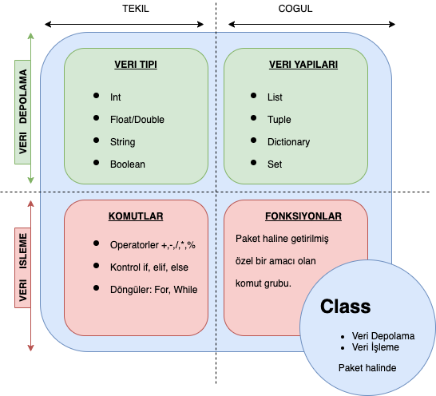

# GSU-Dersler

 - Python Cheat Sheet [Link](http://ehmatthes.github.io/pcc/cheatsheets/README.html)
 - Python ve Veri Bilimine Giriş [Link](https://github.com/uzay00/KaVe-Egitim/tree/master/VeriBilimi)
 - Python ve Yapay Öğrenmeye Giriş [Link](https://github.com/kaveai/veribilimiyazokulu)

## Takip ettığımız kitap

Computer Science: An Overview: Global Edition, 13th Edition
Glenn Brookshear, Dennis Brylow, Marquette University ©2019 , Pearson 

Kitap İçeriği: [Icerik](https://www.pearson.com/uk/educators/higher-education-educators/program/Brookshear-Computer-Science-An-Overview-Global-Edition-13th-Edition/PGM2534163.html?tab=contents)

## Bilgisayım
Bilgisayım, (1) verinin depolanması ve (2) verinin işlenmesi ile ilgilidir. 

 - [Python Temelleri](https://nbviewer.org/github/uzay00/KaVe-Egitim/blob/master/VeriBilimi/0%20-%20Python%20Temeller.ipynb)

