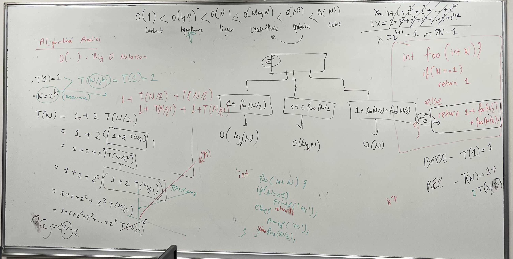

# INF114 Algoritma ve İleri Bilgisayar Programlama

## Week 1: C Dili ile ilgili hatırlatmalar 
## Week 2: Pointers ile ilgili hatirlatmalar
## Week 3: Algortima Analizine Giris
## Week 4: Algortima Analizi ve Master Teorem
## Week 5: Bağlı Listeye Giriş
## Week 6: Bağlı Liste Uygulamaları
## Week 7: Midterm 

### AlgoritmaAnalizi1

### AlgoritmaAnalizi2

### AlgoritmaAnalizi3

### MasterTeorem

