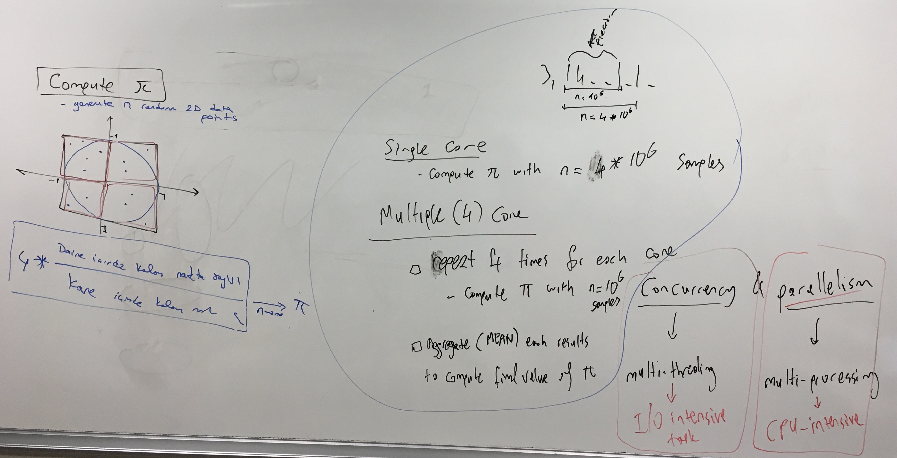

# INF443 Dağıtık Sistemler ve Uygulamalar

## Week 1: Introduction to Distributed Systems

## Week 2: Concurrency vs Parallelism
 - [Concurrency](https://github.com/uzay00/GSU-Dersler/blob/main/INF443%20Da%C4%9F%C4%B1t%C4%B1k%20Sistemler%20ve%20Uygulamalar/Code/Week2/Threads.ipynb)
 - [Parallelism](https://github.com/uzay00/GSU-Dersler/blob/main/INF443%20Da%C4%9F%C4%B1t%C4%B1k%20Sistemler%20ve%20Uygulamalar/Code/Week2/MultiProcessing.ipynb)

### Compute pi emprically

